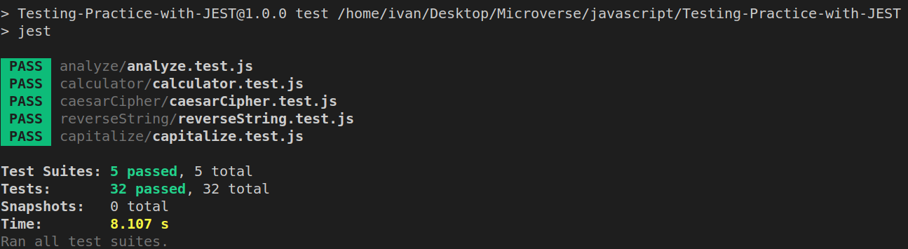

# Testing-Practice-with-JEST

> Testing functions on diferents files with Jest.

    

In this project we test some functions with the tool [Jest](https://jestjs.io/en/) to validate that are working in the desired way and help us to write better code on future projects.

## Built With

- JavaScript.
- [Jest](https://jestjs.io/en/).
- [EsLint](https://eslint.org/).

## Getting Started

To get a local copy up and running follow these simple example steps.

### Prerequisites

Download the project

    $ git clone https://github.com/JuanPabloGil/Testing-Practice-with-JEST.git

Install the dependencies

    $ npm install

### Usage

- Open the console on the root files and run the next command to see the test cases:

    $ npm run test

## Authors

👤 **Ivan Ulises Guzman Sanchez**

- Github: [@fivan18](https://github.com/fivan18)
- Twitter: [@fivanunam](https://twitter.com/fivanunam)
- Linkedin: [fivan](https://www.linkedin.com/in/fivan)

👤 **Juan Pablo Gil**

- [GitHub](https://github.com/JuanPabloGil )
- [@LinkedIn](https://www.linkedin.com/in/juan-pablo-gil-1321a515a/)
- jpablomgil@gmail.com

## 🤝 Contributing

Contributions, issues and feature requests are welcome!

Feel free to check the [issues page](https://github.com/fivan18/todo-list/issues).

## Show your support

Give a ⭐️ if you like this project!

## 📝 License

This project is [MIT](LICENSE) licensed.
